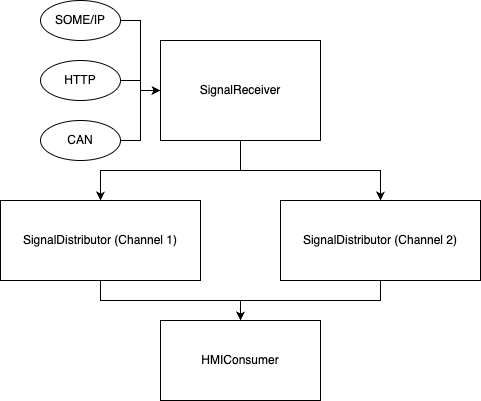

# Signal Processing System

This project implements a basic signal processing system with multiple channels and components. The system is designed to receive signals from various protocols, distribute them across multiple channels, and process them using different consumers.

## Table of Contents

- [Project Structure](#project-structure)
- [System Design](#system-design)
    - [SignalReceiver](#signalreceiver)
    - [SignalDistributor](#signaldistributor)
    - [SignalConsumer](#signalconsumer)
- [Installation](#installation)
- [Running the Project](#running-the-project)

## Project Structure

```plaintext
src/
  implementations/
    SignalReceiverImpl.ts      # Implementation of signal receiver
    SignalDistributorImpl.ts   # Implementation of signal distributor
    HMIConsumerImpl.ts         # Implementation of HMI signal consumer
  interfaces/
    ISignalReceiver.ts         # Interface for signal receiver
    ISignalDistributor.ts      # Interface for signal distributor
    ISignalConsumer.ts         # Interface for signal consumer
  models/
    Signal.ts                  # Signal model
  main.ts                      # Main entry of the application
```

## System Design

### SignalReceiver
    The SignalReceiver interface defines methods for receiving signals from various protocols such as SOME/IP, HTTP, CAN. The implementation SignalReceiverImpl processes these signals and distributes them to the appropriate channels.

### SignalDistributor
    The SignalDistributor interface defines methods for distributing received signals to the respective consumers. The implementation SignalDistributorImpl handles the distribution of signals to the registered consumers.

### SignalConsumer
    The SignalConsumer interface defines methods for consuming the signals needed by the HMI or other components. The implementation HMIConsumerImpl processes the signals as required by the HMI.



## Installation
```bash
# clone repo
git clone https://github.com/Mefedim/signal.git

# go to the project folder
cd signal

# install dependencies
npm install
```

## Running the Project
  To run the project, execute the following command:
```bash
npm start
```